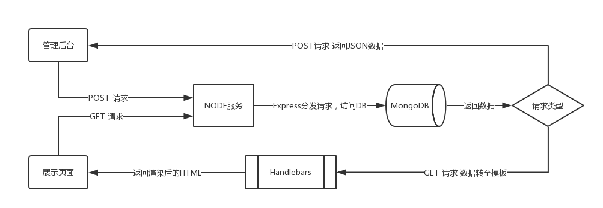

# 新闻管理系统（Demo版）

## 客户端模块：新闻管理（增删查改）
    技术栈：Vue, Vue-router, Axios, Stylus

## 服务端模块：新闻展示（使用模板渲染列表和详情页）
    技术栈：Express, MongoDB, Mongoose, Handlebars

## 相关资源链接
> [Express](http://www.expressjs.com.cn/)  
> MongoDB [下载](https://www.mongodb.com/download-center#community)  [Windows安装](https://docs.mongodb.com/manual/tutorial/install-mongodb-on-windows/)  
> [Mongoose](https://mongoosejs.com/)  
> [Handlebars](http://handlebarsjs.com/)  
> [Robo3t(mongoDB可视化工具)](https://download.robomongo.org/1.2.1/windows/robo3t-1.2.1-windows-x86_64-3e50a65.exe)

## 项目流程图

## 项目结构
<pre>
├── root
  ├── express (路由转发请求，返回html)
      ├── routes
          ├── index.js
          ├── news.js
          ...
      ├── views
          ├── index.hbs
          ├── layout.hbs
          ...
  ├── mongoDB (数据库相关)
      ├── models (mongoDB 数据模型)
          ├── news.js
          ...
      ├── config
          ├── db.js
          ├── data.js
          ...
  ├── src (Vue 项目结构)
      ├── assets
          ├── images
          └── stylesheet
      ├── components (组件)
          ├── layout
              ├── Header.vue
              └── Index.vue
          ├── modules (通用组件)
              ├── Panination.vue
              ├── RichText.vue
              ├── index.js
              ...
      ├── pages (页面级组件)
          └── display
              ├── List.vue
              └── Detail.vue
      ├── router (路由配置)
          ├── routes
              └── display.js
          └── index.js
      ├── utils (工具库)
      ├── App.vue
      └── main.js
</pre>

## 项目搭建：
> 初始化Vue项目及启动：

    vue init webpack manage-news
    cd manage-news && npm i
    npm run dev

> 启动express应用(自定义服务命令)

    npm run server
**Note:**
1. express目录下文件由expres应用生成器生成
2. 使用nodemon包做了express应用热更新处理（内容更改不需重启，仍需刷新）

### TODOLIST
> 查询列表不需要正文
